# Roteiro de Certificação — Fiserv e-SiTef (Cartão + PIX)

> Ambiente de homologação: `https://esitef-homologação.softwareexpress.com.br/e-sitef/api/`
> Data de início: 2026-04-10

---

## Cartões de Teste

| Bandeira | Número | Vencimento | CVV | CPF |
|---|---|---|---|---|
| VISA | `4000 0000 0000 0044` | mês/ano atual | 123 | — |
| VISA (19 dígitos) | `4563 4700 0000 0000 004` | mês/ano atual | 123 | — |
| MASTERCARD | `5000 0000 0000 0001` | mês/ano atual | 123 | — |
| MASTERCARD (19 dígitos) | `5390 0000 0000 0000 009` | mês/ano atual | 123 | — |
| AMEX | `3764 0000 0000 016` | mês/ano atual | 123 | — |
| HIPERCARD | `6062 8200 0000 001` | mês/ano atual | 123 | — |
| DINERS | `3634 5600 0000 01` | mês/ano atual | 123 | — |
| ELO | `6362 9700 0045 7013` | mês/ano atual | 123 | — |
| SODEXO Cultura | `6060 7001 2476 5016` | mês/ano atual | 123 | 581.935.914-37 |
| SODEXO Alimentação | `6033 8900 0000 0007` | mês/ano atual | 123 | 581.935.914-37 |
| SODEXO Refeição | `6060 7133 3914 2012` | mês/ano atual | 123 | 581.935.914-37 |

> **OBS:** Todos os cartões usam **vencimento = mês e ano atuais** e **CVV = 123**

---

## Alertas do Módulo

>  **getStatus — Retry de 3 tentativas NÃO implementado**
>
> A documentação da Fiserv exige:
> - Timeout de 60 segundos aguardando resposta
> - Após timeout: chamar `getStatus` (até **3 tentativas**)
> - Após 3 falhas consecutivas: **bloquear nova tentativa de pagamento** do mesmo pedido
>
> **O que o módulo faz hoje:** O `CronJob/CheckPaymentStatus.php` chama `updateStatusOrderById()` **uma única vez** por pedido, sem loop de retentativas, sem contagem de tentativas e sem bloqueio de reenvio.
>
> **Arquivo afetado:** `Core/CronJob/CheckPaymentStatus.php` e `Core/Model/Notifications/Topics/Payment.php`
>
> **Ação necessária antes da certificação:** Implementar loop com máximo de 3 tentativas e bloqueio de novo pagamento em caso de falha total.

---

## Legenda

- `[ ]` — Não testado
- `[x]` — Aprovado
- `[!]` — Falhou / problema encontrado
- `[~]` — Testado parcialmente / com ressalvas

---

## BLOCO 1 — Pagamento com Cartão (Obrigatório)

### 1.1 Pagamento à vista — APROVADO

| # | Bandeira | Número | Valor | NSU e-SiTef | Order ID | Merchant USN | Status | Data |
|---|---|---|---|---|---|---|---|---|
| 1 | VISA | `4000 0000 0000 0044` | R$ 250,00 | 260410138563214 | 000000001 | 1 | `[x]` | 10/04/2026 |
| 2 | MASTERCARD | `5000 0000 0000 0001` | R$ 250,00 | 260417139438524 | 000000036 | 36 | `[x]` | 17/04/2026 |
| 3 | AMEX | `3764 0000 0000 016` | R$ 250,00 | — | 000000038/039 | 38/39 | `[!]` | 17/04/2026 |
| 4 | DINERS | `3634 5600 0000 01` | R$ 250,00 | 260410138565254 | 000000007 | 7 | `[x]` | 10/04/2026 |
| 5 | HIPERCARD | `6062 8200 0000 001` | R$ 250,00 | 260410138572744 | 000000016 | 16 | `[x]` | 10/04/2026 |
| 6 | ELO | `6362 9700 0045 7013` | R$ 250,00 | 260410138573084 | 000000017 | 17 | `[x]` | 10/04/2026 |
| 7 | VISA (19 dígitos) | `4563 4700 0000 0000 004` | R$ 250,00 | 260410138573664 | 000000018 | 18 | `[x]` | 10/04/2026 |
| 8 | MASTERCARD (19 dígitos) | `5390 0000 0000 0000 009` | R$ 250,00 | 260417139438574 | 000000037 | 37 | `[x]` | 17/04/2026 |
| 9 | VISA (retest + evidência getStatus) | `4000 0000 0000 0044` | R$ 250,00 | 260417139437684 | 000000035 | 35 | `[x]` | 17/04/2026 |

**Fluxo esperado:** Pagamento processado → pedido com status "Aprovado" → fatura gerada automaticamente.

>  **Observação:** O módulo está usando fluxo de pré-autorização (`POST /v1/preauthorizations`) mesmo para pagamento à vista. O comprovante retornado traz `PRE-AUT. SIM.`. Verificar se a Fiserv aceita esse fluxo na certificação ou se é necessário usar `POST /v1/payments` direto.

**Evidências:**

| Bandeira | Evidência |
|---|---|
| VISA | 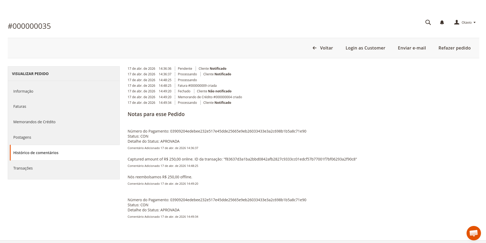 |
| MASTERCARD | 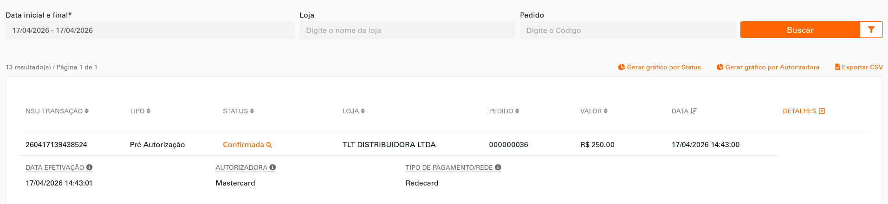 |
| AMEX | 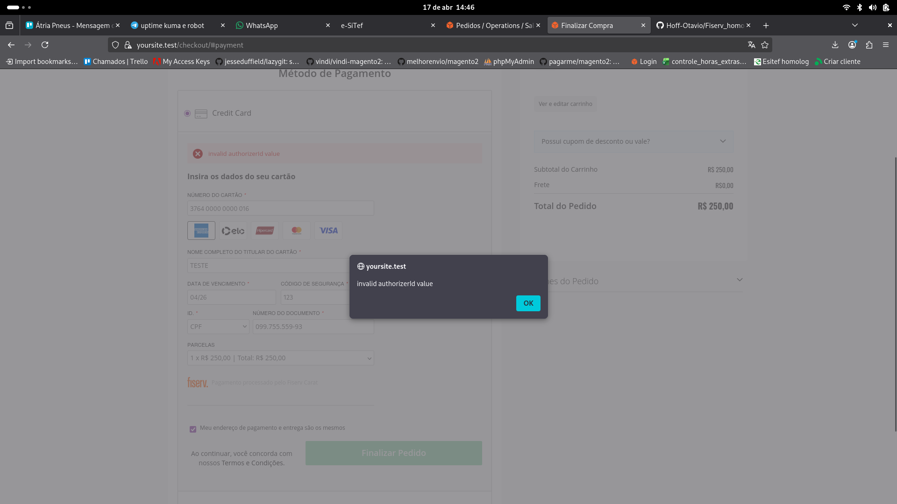 |
| DINERS | 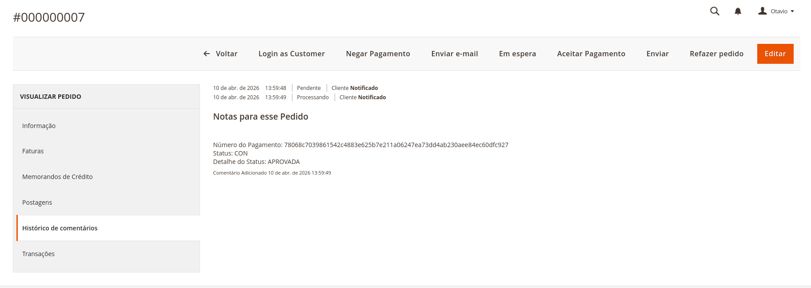 |
| HIPERCARD |  |
| ELO |  |
| VISA 19 dígitos |  |
| MASTERCARD 19 dígitos |  |

---

### 1.2 Pagamento com status NEGADO (Obrigatório)

| # | Bandeira | Valor | NSU e-SiTef | Order ID | Status | Data |
|---|---|---|---|---|---|---|
| 5 | VISA | R$ 22.000,00 (2200000 centavos) | 260410138566284 | 000000009 | `[x]` | 10/04/2026 |

**Fluxo esperado:** Pagamento recusado pela autorizadora → pedido com status "Negado" → sem fatura.

**Evidência:**

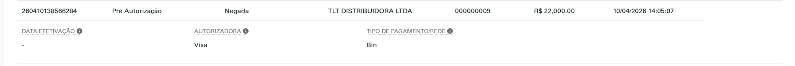

---

### 1.3 Cancelamento / Estorno com Cartão (Obrigatório)

| # | Descrição | Valor | NSU e-SiTef | Order ID | Status | Data |
|---|---|---|---|---|---|---|
| 6 | Estorno de pagamento aprovado | R$ 250,00 | — | 000000035 | `[!]` | 17/04/2026 |

**Fluxo esperado:** Pedido aprovado → solicitar estorno → API recebe cancel → pedido muda para "Estornado" / "Cancelado".

**Evidências (BUG-005 — falha silenciosa no gateway):**

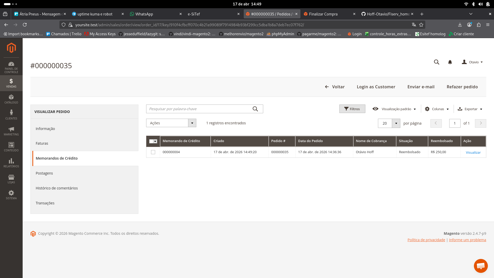

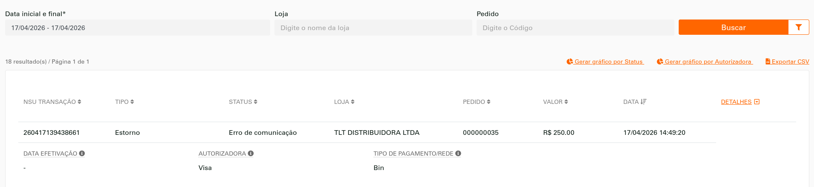

---

### 1.2 Pagamento com Voucher — Alimentação / Refeição (Opcional)

| # | Bandeira | Número | Valor | NSU e-SiTef | Order ID | Status | Data |
|---|---|---|---|---|---|---|---|
| 9 | SODEXO Cultura | `6060 7001 2476 5016` | R$ 250,00 | 260410138573744 | 000000020 | `[!]` | 10/04/2026 |
| 10 | SODEXO Alimentação | `6033 8900 0000 0007` | R$ 250,00 | 260410138574724 | 000000022 | `[!]` | 10/04/2026 |
| 11 | SODEXO Refeição | `6060 7133 3914 2012` | R$ 250,00 | 260410138574784 | 000000023 | `[!]` | 10/04/2026 |
| 12 | ALELO Cultura | `5090 1600 0002 016` | R$ 250,00 | 260410138574794 | 000000024 | `[x]` | 10/04/2026 |
| 13 | ALELO Refeição | `4058 7411 1111 1111 111` | R$ 250,00 | 260410138577574 | 000000025 | `[x]` | 10/04/2026 |

> Vouchers SODEXO exigem **CPF: 581.935.914-37** no checkout.

---

### 1.3 Pagamento Parcelado (Opcional)

| # | Descrição | Parcelas | Valor | NSU e-SiTef | Order ID | Status | Data |
|---|---|---|---|---|---|---|---|
| 7 | Parcelado **sem juros** | 3x | — | | | `[ ]` | |
| 8 | Parcelado **com juros** | 3x | — | | | `[ ]` | |

---

### 1.4 Pré-autorização e Captura (Opcional)

| # | Descrição | Valor | NSU e-SiTef | Order ID | Status | Data |
|---|---|---|---|---|---|---|
| 9 | Pré-autorização | R$ 10,00 | | | `[ ]` | |
| 10 | Captura da pré-autorização | R$ 10,00 | | | `[ ]` | |

**OBS:** Captura é **obrigatória** se pré-autorização for certificada.

---

## BLOCO 2 — Consulta de Status / Timeout (Obrigatório)

>  **Atenção:** Ver alerta acima sobre implementação incompleta do retry.

| # | Descrição | Valor | NSU e-SiTef | Order ID | Status | Data |
|---|---|---|---|---|---|---|
| 11 | Timeout + getStatus → transação **APROVADA** | R$ 255,00 (25500 centavos) | 260417139434730 | 000000028 | `[x]` | 17/04/2026 |
| 12 | Timeout + getStatus → transação **NEGADA/CANCELADA** | R$ 10,00 (1000 centavos) | 260417139436770 | 000000034 | `[x]` | 17/04/2026 |

**Fluxo esperado (caso 11):**
1. Transação enviada → sem resposta (timeout de 60s)
2. Aplicação chama `getStatus` (até 3x)
3. Resposta indica APROVADA → pedido atualizado, fatura gerada
4. Cliente não consegue enviar novo pagamento para o mesmo pedido

**Fluxo esperado (caso 12):**
1. Transação enviada → sem resposta (timeout de 60s)
2. Aplicação chama `getStatus` (até 3x)
3. Resposta indica NEGADA → pedido atualizado, sem fatura
4. Cliente não consegue enviar novo pagamento para o mesmo pedido

> **Resultado 17/04/2026 — Caso 11 (APROVADA):** Fluxo demonstrado com PIX como substituto ao timeout de cartão. Order 000000028 (PIX R$ 255,00) criado com status `PEN`. Cron `CheckPaymentStatus` chamou `getTransactionByOrder` (= endpoint `GET /v1/transactions/{nit}`) e recebeu `status: CON`. Módulo criou fatura automaticamente e atualizou status do pedido para `processing`. Log confirmou: `createInvoice 1` + `Update Transaction - Order 000000028 - Status processing`.
>
> **Resultado 17/04/2026 — Caso 12 (NEGADA/CANCELADA):** Order 000000034 (PIX R$ 10,00) criado com status `PEN` → cancelado manualmente no painel e-SiTef → Cron chamou `getTransactionByOrder` e recebeu `status: EST` (estornado/cancelado). Módulo atualizou status do pedido para `canceled`. Log confirmou: `Update Transaction - Order 000000034 - Status canceled`.
>
> **Ressalva:** O ambiente de homologação e-SiTef não expõe mecanismo de timeout real de 60s para cartão. O fluxo de `getStatus` foi demonstrado via PIX (polling de PEN → status final), o que cobre funcionalmente o mesmo código (`Core/CronJob/CheckPaymentStatus.php` → `getTransactionByOrder`). O retry de 3 tentativas **ainda não está implementado** (ver alerta no topo).

**Evidências:**

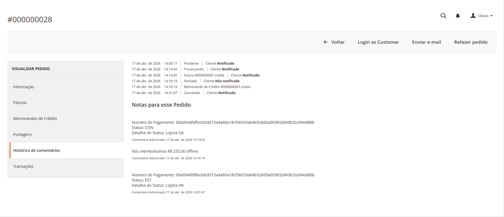

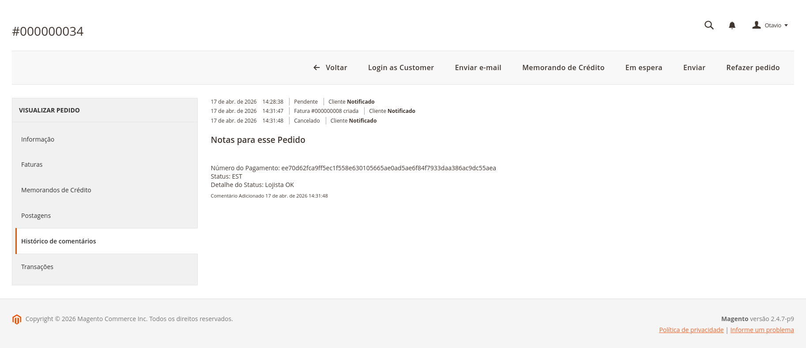

---

## BLOCO 3 — PIX (Obrigatório)

### 3.1 PIX Confirmado

| # | Descrição | Valor | NSU e-SiTef | Order ID | Status | Data |
|---|---|---|---|---|---|---|
| 13 | PIX **confirmado** | R$ 10,00 (1000 centavos) | 260410138567540 | 000000011 | `[x]` | 10/04/2026 |

**Fluxo esperado:** QR Code gerado → pagamento PIX realizado → webhook de notificação recebido → pedido aprovado → fatura gerada.

> **Adendo:** Confirmação realizada via painel admin de homologação. Status `CON` detectado automaticamente pelo cron `checkPaymentStatus`.

**Evidência:**


---

### 3.2 PIX Negado

| # | Descrição | Valor | NSU e-SiTef | Order ID | Status | Data |
|---|---|---|---|---|---|---|
| 14 | PIX **negado na autorizadora** | R$ 5,00 (500 centavos) | 260417139434770 | 000000029 | `[x]` | 17/04/2026 |

**Fluxo esperado:** QR Code gerado → autorizadora nega → pedido com status "Negado".

**Evidência:**

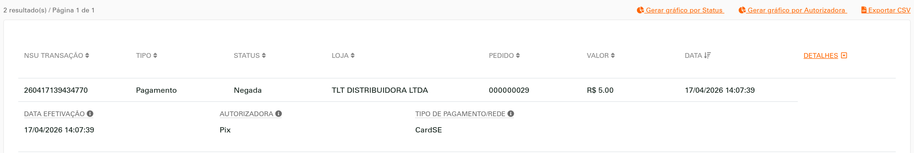

---

### 3.3 PIX Erro

| # | Descrição | Valor | NSU e-SiTef | Order ID | Status | Data |
|---|---|---|---|---|---|---|
| 15 | PIX **erro** | R$ 6,00 (600 centavos) | 260417139435840 | 000000031 | `[x]` | 17/04/2026 |

**Fluxo esperado:** QR Code gerado → erro no processamento → pedido com status de erro.

> **Resultado 17/04/2026:** Gateway retornou `status: ERR`, code 131 — `"Communication fail with SiTef / Servico Indisp."` — comportamento esperado para 600 centavos com acesso ao portal e-SiTef ativo.

**Evidência:**

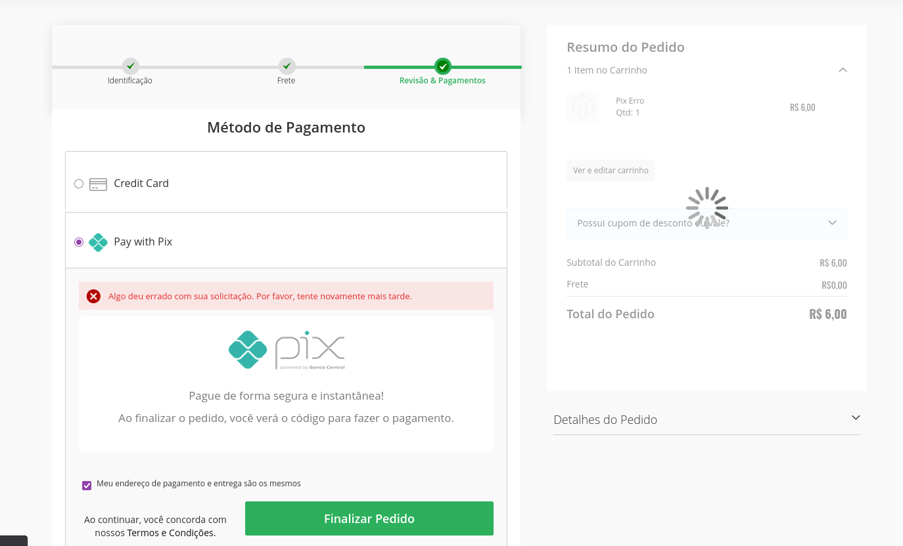

---

### 3.4 Estorno PIX (Obrigatório)

| # | Descrição | Valor | NSU e-SiTef | Order ID | Status | Data |
|---|---|---|---|---|---|---|
| 16 | Estorno de pagamento PIX aprovado | R$ 255,00 | 260417139434730 | 000000028 | `[~]` | 17/04/2026 |

**Fluxo esperado:** PIX aprovado → solicitar estorno → API processa devolução → pedido com status "Estornado".

> **Resultado 17/04/2026:** Fluxo concluído com workaround. PIX Order 000000028 (R$ 255,00) confirmado via painel e-SiTef → cron detectou CON e gerou fatura (após correção BUG-011) → memorando de crédito criado no Magento (offline) → cancel via API falhou com `code 115` (BUG-006) → estorno processado manualmente no painel e-SiTef com sucesso (NSU e-SiTef: 260417139434730, confirmado na tela "Transação cancelada com sucesso!").
> **Pendência:** O cancel automático via módulo (`RefundObserverBeforeSave`) ainda retorna `code 115 — "Authenticity error"` para PIX. BUG-006 persiste e precisa de correção no endpoint de estorno PIX.

**Evidências:**

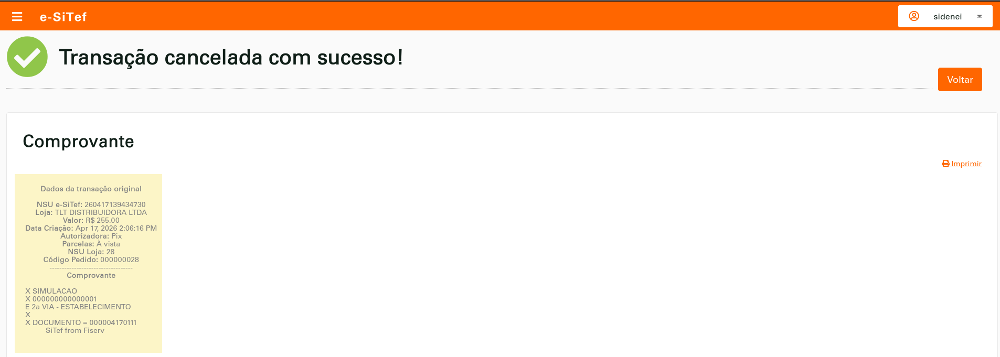


---

## BLOCO 4 — Tokenização (Opcional)

| # | Descrição | NSU e-SiTef | Order ID | Status | Data |
|---|---|---|---|---|---|
| 17 | Armazenamento de cartão (tokenização) | | | `[ ]` | |
| 18 | Pagamento com cartão armazenado (token) | | | `[ ]` | |

---

## BLOCO 5 — 3DS 2.0 (Obrigatório para Débito)

> **BLOQUEADO — Credenciais 3DS não disponíveis neste ambiente.**
>
> O módulo possui implementação completa do fluxo 3DS (`Core/Model/Threeds.php`, `Core/Controller/Threeds/*`), porém o serviço de autenticação 3DS exige credenciais separadas das credenciais e-SiTef (3DS Merchant Id, 3DS Merchant Key, Merchant MCC, Acquirer Merchant Id). Essas credenciais não foram fornecidas para este ambiente de homologação. Todos os testes do Bloco 5 foram bloqueados por esse motivo.

### Fluxo de Autenticação 3DS

| # | Status Esperado | Valor (centavos) | Trans ID | Data | Status |
|---|---|---|---|---|---|
| 19 | **CON** (Autenticado) | 10000 | | | `[!]` |
| 20 | **Challenge** (Desafio) | 10004 | | | `[!]` |
| 21 | **NEG** (Negado) | 10001 | | | `[!]` |

### Efetivação com dados 3DS

| # | Descrição | NSU e-SiTef | Valor | Order ID | Status | Data |
|---|---|---|---|---|---|---|
| 22 | Pagamento enviando `eci`, `reference_id`, `cavv` da autenticação 3DS | | | | `[!]` | |

**Payload obrigatório na efetivação:**
```json
"external_authentication": {
    "eci": "xxx",
    "reference_id": "string",
    "cavv": "string"
}
```

---

## Evidências Obrigatórias

- [x] Prints do fluxo completo de pagamento (todas as telas) — ver seções 1.1, 1.2, 1.3, 3.1–3.4
- [x] Prints do fluxo de Consulta de Status — transação **Aprovada** — ver Bloco 2
- [x] Prints do fluxo de Consulta de Status — transação **Negada** — ver Bloco 2

### Índice de Evidências

| Arquivo | Descrição | Seção |
|---|---|---|
| `01_pix_negado_portal_esitef.png` | PIX Negado — portal e-SiTef, Order 000000029 | 3.2 |
| `02_pix_estorno_portal_esitef.png` | Estorno PIX — "Transação cancelada com sucesso!", Order 000000028 | 3.4 |
| `03_pix_erro_checkout.png` | PIX Erro — checkout exibe erro para R$6,00 | 3.3 |
| `04_mastercard_aprovado_portal_esitef.png` | MASTERCARD aprovado — portal e-SiTef, Order 000000036 | 1.1 |
| `05_amex_bug004_invalid_authorizer.png` | AMEX BUG-004 — "invalid authorizerId value" no checkout | 1.1 / BUG-004 |
| `06_estorno_cartao_magento_creditmemo.png` | Estorno cartão — Memorando de Crédito no Magento, Order 000000035 | 1.3 |
| `07_estorno_cartao_portal_erro_comunicacao.png` | Estorno cartão — portal e-SiTef "Erro de comunicação" BUG-005 | 1.3 / BUG-005 |
| `08_visa_aprovado_magento_historico.png` | VISA aprovado — histórico Magento, Order 000000035 | 1.1 |
| `09_cartao_negado_portal_esitef.png` | Cartão NEGADO — portal e-SiTef, Order 000000009 R$22.000,00 | 1.2 |
| `10_pix_confirmado_getstatus_aprovado_magento.png` | PIX Confirmado + getStatus APROVADO — Order 000000028 PEN→CON | 3.1 / Bloco 2 |
| `11_getstatus_cancelado_magento.png` | getStatus NEGADO — Order 000000034 PEN→EST→Cancelado | Bloco 2 |
| `13_diners_aprovado_magento.png` | DINERS aprovado — histórico Magento, Order 000000007 | 1.1 |
| `14_hipercard_aprovado_magento.png` | HIPERCARD aprovado — histórico Magento, Order 000000016 | 1.1 |
| `15_elo_aprovado_magento.png` | ELO aprovado — histórico Magento, Order 000000017 | 1.1 |
| `16_visa_19digitos_aprovado_magento.png` | VISA 19 dígitos aprovado — histórico Magento, Order 000000018 | 1.1 |
| `17_mastercard_19digitos_aprovado_magento.png` | MASTERCARD 19 dígitos aprovado — histórico Magento, Order 000000037 | 1.1 |

---

## Progresso Geral

| Bloco | Total | Concluídos | Parciais | Falhos | Pendentes |
|---|---|---|---|---|---|
| 1 — Cartão (obrigatórios) | 6 | 3 | 0 | 2 | 1 |
| 1 — Vouchers | 5 | 2 | 0 | 3 | 0 |
| 2 — Timeout / getStatus | 2 | 2 | 0 | 0 | 0 |
| 3 — PIX | 4 | 2 | 1 | 1 | 0 |
| 4 — Tokenização | 2 | 0 | 0 | 0 | 2 |
| 5 — 3DS 2.0 | 4 | 0 | 0 | 0 | 4 |
| **Total** | **23** | **9** | **1** | **6** | **7** |

---

## Resumo da Sessão de Testes — 10/04/2026

### O que passou
| # | Teste | Order | e-SiTef USN |
|---|---|---|---|
| 1 | Pagamento à vista VISA | 000000001 | 260410138563214 |
| 4 | Pagamento à vista DINERS | 000000007 | 260410138565254 |
| 5 | Pagamento NEGADO (VISA R$ 22.000,00) | 000000009 | 260410138566284 |
| 13 | PIX confirmado (R$ 10,00) | 000000011 | 260410138567540 |

### O que falhou
| # | Teste | Order | Motivo | Bug |
|---|---|---|---|---|
| 2 | Pagamento à vista MASTERCARD | 000000004 | Rede — "Operacao nao permitida" (code 134) | BUG-002 |
| 3 | Pagamento à vista AMEX | 000000005/006 | authorizer_id "3" inválido (code 5) | BUG-004 |
| 6 | Estorno cartão VISA | 000000001 | "Authenticity error" — NSU errado no cancel | BUG-005 |
| 14 | PIX negado | 000000013 | Cancel rejeitado pelo gateway (PIX ainda PEN) | BUG-006 |

### O que ficou parcial
| # | Teste | Order | Motivo |
|---|---|---|---|
| 15 | PIX erro (R$ 6,00) | 000000015 | QR Code gerado (PEN), simulação de erro requer painel Fiserv |
| 16 | Estorno PIX | — | Bloqueado: PIX não chega a CON sem painel Fiserv |

### O que não foi testado 
- Timeout / getStatus (Blocos 2)
- Tokenização (Bloco 4)
- 3DS 2.0 (Bloco 5)

### Bugs a corrigir antes da certificação
| Bug | Descrição | Severidade |
|---|---|---|
| BUG-001 | `installment_type: "4"` hardcoded para crédito | Alta |
| BUG-002 | MASTERCARD rejeitada pelo adquirente REDE | Alta |
| BUG-003 | Pagamento à vista usa fluxo de pré-autorização | Média |
| BUG-004 | AMEX com `authorizer_id: "3"` inválido | Alta |
| BUG-005 | Estorno de cartão usa NSU da pré-autorização em vez da captura | Alta |
| BUG-006 | Cancel/estorno de PIX pendente falha no gateway | Alta |
| BUG-007 | Máscara do campo de cartão trunca números com 19 dígitos para 16 | Alta |
| BUG-008 | Vouchers SODEXO/ALELO rejeitados — authorizer_id incorreto para voucher | Alta |
| BUG-009 | Campo CPF nunca renderizado — `let` local em `caratLoadAdditionalInfo` nunca atualiza o global | Alta |
| BUG-010 | Código 102 — reenvio de pagamento em pedido já com transação finalizada | Média |
| — | getStatus sem retry de 3 tentativas (pendente implementação) | Alta |

---

## Erros Encontrados

### BUG-001 — `installment_type: "4"` hardcoded para crédito
- **Severidade:** Alta
- **Arquivo:** `Core/Model/Custom/Payment.php` linhas 545, 627, 769
- **Descrição:** O campo `installment_type` está fixado com valor `"4"` para todos os pagamentos com cartão de crédito. Na API Fiserv e-SiTef, `"4"` corresponde a PIX/pré-datado, não crédito à vista. O adquirente Bin aceitou no sandbox (permissivo), mas o REDE rejeitou.
- **Impacto:** Pagamentos via adquirentes mais restritivos (Rede, Cielo) podem ser recusados.
- **Correção:** Mapear corretamente o `installment_type` por tipo de transação (`1` = à vista crédito, `2` = parcelado emissor, `3` = parcelado lojista).

---

### BUG-002 — MASTERCARD rejeitada pelo adquirente REDE (homologação)
- **Severidade:** Alta
- **Teste:** #2 — Pagamento à vista MASTERCARD
- **Order ID:** 000000004 | **e-SiTef USN:** 260410138564154
- **Descrição:** MASTERCARD é roteada para `authorizer_id: "2"` (REDE). A REDE retornou `code 134 — "Error on card query"` com `authorizer_code: 255 — "Operacao nao permitida"`.
- **Causa provável:** Conta de homologação não tem MASTERCARD habilitado via Rede, ou `authorizer_id` incorreto para o ambiente de teste. VISA (`authorizer_id: "1"` → Bin) funcionou normalmente.
- **Correção:** Verificar junto à Fiserv qual `authorizer_id` deve ser usado para MASTERCARD no ambiente de homologação, ou habilitar MASTERCARD na conta Rede de teste.

---


### BUG-003 — Fluxo de pagamento à vista usa pré-autorização
- **Severidade:** Média
- **Arquivo:** `Core/Model/Custom/Payment.php`
- **Descrição:** Pagamentos à vista estão sendo processados via `POST /v1/preauthorizations` com `transaction_type: "preauthorization"`, em vez de `POST /v1/payments`. O comprovante retorna `PRE-AUT. SIM.`.
- **Impacto:** Pode ser questionado pela Fiserv na certificação, pois o roteiro distingue pagamento à vista de pré-autorização como casos separados.
- **Correção:** Avaliar se o fluxo de pagamento configurado como "authorize" no admin deve usar `/v1/payments` direto para à vista.

---

### BUG-004 — AMEX com `authorizer_id: "3"` inválido para este merchant
- **Severidade:** Alta
- **Teste:** #3 — Pagamento à vista AMEX
- **Order IDs:** 000000005, 000000006
- **Descrição:** AMEX é mapeada para `authorizer_id: "3"` no código, porém a API retornou `code 5 — "invalid authorizerId value"`. O ID não existe para este merchant de homologação.
- **Padrão identificado:** Apenas `authorizer_id: "1"` (Bin) funcionou até agora. MASTERCARD (`"2"`) e AMEX (`"3"`) falharam por motivos diferentes — Rede recusou a operação, AMEX sequer tem o ID habilitado.
- **Correção:** Os `authorizer_id` precisam ser configuráveis por bandeira no admin, ou alinhados com a Fiserv quais IDs estão disponíveis nessa conta de homologação.

---


### BUG-005 — Estorno usa NSU da pré-autorização em vez da captura
- **Severidade:** Alta
- **Teste:** #6 — Cancelamento / Estorno
- **Order ID:** 000000035 (retest 17/04/2026)
- **Descrição:** Ao emitir memorando de crédito, o módulo enviou o cancel usando o NSU da **pré-autorização original** em vez da captura. A API retornou `code 115 — "Authenticity error"`.
- **Agravante (17/04/2026):** O módulo **não exibe erro ao usuário** quando o cancel falha no gateway. O memorando de crédito é criado no Magento com aparência de sucesso, mas a cobrança no gateway **não é revertida**. Risco de prejuízo financeiro em produção.
- **Arquivo afetado:** `Core/Model/Custom/Payment.php` método `refund()` e `Core/Observer/RefundObserverBeforeSave.php`
- **Correção:** O estorno deve usar o `esitef_usn` da **captura**, não da pré-autorização inicial. Falha no gateway deve bloquear ou alertar a criação do memorando.

---

### BUG-011 — Cron não atualiza pedido PIX confirmado via portal (canCreditmemo() bloqueando)
- **Severidade:** Alta
- **Arquivo:** `Core/Model/Notifications/Topics/Payment.php` linha 199
- **Descrição:** O método `updateStatusOrderById()` verificava `$order->canCreditmemo()` antes de chamar `updateStatusOrderByPayment()`. Pedidos PIX recém-criados são `pending/new` sem fatura — `canCreditmemo()` retorna `false` — então o cron detectava o status `CON` no gateway mas não criava a fatura nem atualizava o pedido no Magento.
- **Correção aplicada:** Removida a condição `$order->canCreditmemo()` da linha 199. A verificação não faz sentido aqui — o propósito do método é precisamente criar a fatura quando o gateway confirma o pagamento.
- **Impacto anterior:** PIX confirmado pelo painel e-SiTef ficava eternamente em `pending` no Magento.

---

### BUG-006 — Cancelamento/estorno de PIX falha com "Authenticity error"
- **Severidade:** Alta
- **Testes:** #8 — PIX Negado (orders 000000012, 000000013)
- **Descrição:** Dois comportamentos distintos identificados:
  - **Order 000000012:** `OrderCancelPlugin` bloqueou o cancel no gateway porque `canCreditmemo()` retorna `false` (sem invoice). O pedido foi cancelado só no Magento.
  - **Order 000000013:** O cancel foi enviado ao gateway com o NSU correto (`260410138569670`), mas a API retornou `code 115 — "Authenticity error"`. Causa: o PIX foi aceito apenas no Magento (via invoice manual), mas o gateway ainda registrava a transação como `PEN`. A API Fiserv rejeita o cancel de transações não confirmadas no gateway.
- **Arquivo afetado:** `Core/Plugin/OrderCancelPlugin.php` e `Core/Model/Core.php::doCancel()`
- **Correção:** O fluxo de cancelamento de PIX precisa: (1) verificar o status real no gateway antes de tentar cancelar; (2) para PIX em `PEN`, usar o endpoint correto de cancelamento de PIX pendente (diferente do cancel de crédito aprovado).

---

### BUG-007 — Máscara do campo de cartão trunca números com 19 dígitos para 16
- **Severidade:** Alta
- **Teste:** #8 — MASTERCARD 19 dígitos
- **Order ID:** 000000019 | **e-SiTef USN:** 260410138573714
- **Descrição:** O campo de número do cartão no checkout trunca cartões de 19 dígitos para 16. No log, o cartão `5390 0000 0000 0000 009` foi enviado ao gateway como `539000******0000` (16 dígitos), perdendo os 3 últimos dígitos. Isso invalida o número do cartão enviado ao gateway.
- **Arquivo afetado:** `Core/view/frontend/web/js/Masks.js` e/ou template do formulário de cartão — o `maxlength` do input provavelmente está fixado em 16.
- **Correção:** O campo de número do cartão deve aceitar até 19 dígitos (`maxlength="19"`) e a máscara deve se adaptar ao comprimento detectado da bandeira.
- **Nota:** Mesmo que corrigido, MASTERCARD ainda falharia via Rede (BUG-002). Ambos precisam ser resolvidos.

---

### BUG-009 — Campo CPF nunca renderizado no checkout (variável local em `caratLoadAdditionalInfo`)
- **Severidade:** Alta
- **Arquivo:** `Core/view/frontend/web/js/CreditCard.js` linha 280
- **Descrição:** A função `caratLoadAdditionalInfo()` declarava o objeto de controle dos campos adicionais com `let additionalInfoNeeded = {...}`, criando uma **variável local** que é descartada ao fim da função. A função `caratAdditionalInfoHandler()` lê `additionalInfoNeeded` da cadeia de escopo — que resolve para `window.additionalInfoNeeded = {}` (sempre vazio). Resultado: nenhum campo adicional (CPF, nome do portador, emissor) é jamais exibido, independente de qualquer configuração de antifraude.
- **Correção aplicada:** Alterado `let additionalInfoNeeded = {` para `window.additionalInfoNeeded = {` na linha 280 — a variável global é agora atualizada corretamente.
- **Impacto:** CPF obrigatório para vouchers e antifraude nunca era enviado ao gateway.

---

### BUG-010 — Código 102 com antifraude ativo: análise de risco não habilitada no portal e-SiTef
- **Severidade:** N/A — comportamento esperado do ambiente, não bug do módulo
- **Orders:** 000000026, 000000027
- **Descrição:** O módulo enviou `anti_fraud: "enabled_after_auth"` no payload do `POST /v1/transactions`, mas o recurso de **Análise de Risco não está habilitado nas configurações do merchant no portal e-SiTef** (confirmado via acesso ao painel). O gateway retornou `code 102 — "Transaction in progress or finalized"` rejeitando a pré-autorização.
- **Confirmação positiva:** O CPF foi enviado corretamente após a correção do BUG-009 (`legal_document`, `cnpj_cpf`, `identification_number` — todos populados com `58193591437`).
- **Ação necessária:** Para usar antifraude em produção, o recurso precisa ser habilitado pelo time da Fiserv nas configurações do merchant no portal e-SiTef antes de ativar a funcionalidade no módulo.
- **Antifraude desabilitado no admin do Magento** em 11/04/2026 para prosseguir com os testes restantes.

---

### BUG-008 — Vouchers SODEXO/ALELO rejeitados pelo adquirente BIN com "Emissor desconhecido"
- **Severidade:** Alta
- **Teste:** #9 — SODEXO Cultura
- **Order ID:** 000000020 | **e-SiTef USN:** 260410138573744
- **Descrição:** SODEXO Cultura (`6060 7001 2476 5016`) foi enviado ao adquirente BIN (`authorizer_id: "1"`), que retornou `code 134 — "Error on card query"` com `authorizer_code: 255 — "Emissor desconhecido"`. O BIN não reconhece cartões SODEXO como emissores válidos.
- **Causa:** O módulo não possui `authorizer_id` específico para vouchers de alimentação/refeição (SODEXO, ALELO). Esses cartões exigem um adquirente/autorizador específico para vouchers, diferente do `authorizer_id: "1"` (BIN) usado para crédito/débito.
- **Arquivo afetado:** `Core/Model/Custom/Payment.php` método `getAuthorizerId()` — sem mapeamento para prefixos de voucher.
- **Correção:** Verificar junto à Fiserv quais `authorizer_id` correspondem aos adquirentes de voucher (SODEXO, ALELO) habilitados para este merchant, e mapear os BINs/prefixos corretos no método `getAuthorizerId()`.
- **Impacto:** Todos os testes de voucher (SODEXO Cultura, Alimentação, Refeição; ALELO Cultura, Refeição) provavelmente falharão com o mesmo erro.
- **Problema secundário — CPF não enviado:** O campo CPF no formulário de checkout só é exibido quando o módulo de antifraude está ativo (`antiFraud = true` em `CreditCard.js`, linha 37). Sem antifraude habilitado no admin, o campo CPF não é renderizado e, portanto, não é enviado ao gateway. Vouchers SODEXO/ALELO exigem CPF do portador. Mesmo corrigindo o `authorizer_id`, o pagamento pode ser rejeitado por ausência de CPF.
  - **Arquivo afetado:** `Core/view/frontend/web/js/CreditCard.js` função `initCaratCardForm()` — o array `additional_info_needed` precisa incluir `cardholder_identification_type` e `cardholder_identification_number` para bandeiras de voucher independente do antifraude.

---

